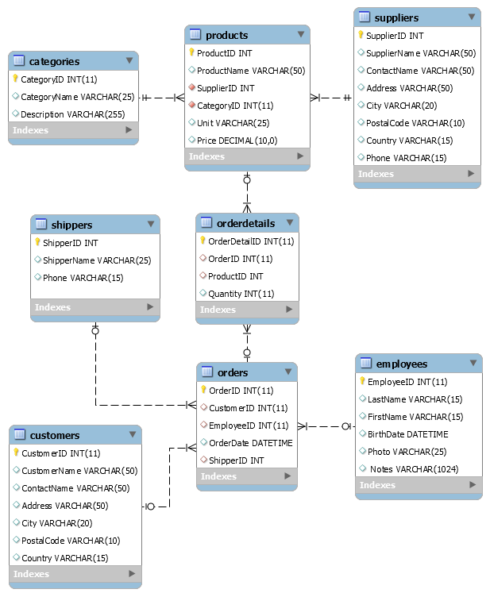

# ETL proces datasetu NorthWind

Tento repozitár obsahuje implementáciu ETL procesu v Snowflake pre analýzu dát z NorthWind datasetu. Projekt sa zameriava na preskúmanie správania používateľov a ich preferencií pri výbere produktov na základe hodnotení produktov a demografických údajov zákazníkov. Výsledný dátový model umožňuje multidimenzionálnu analýzu a vizualizáciu kľúčových metrik.

<h2>1. Úvod a popis zdrojových dát</h2>

Cieľom semestrálneho projektu je analyzovať dáta týkajúce sa produktov, zákazníkov a ich hodnotení. Táto analýza umožňuje identifikovať trendy v preferenciách zákazníkov, najpopulárnejšie produkty a správanie zákazníkov.

Zdrojové dáta pochádzajú z Kaggle datasetu dostupného <a href="https://www.kaggle.com/datasets/cleveranjosqlik/csv-northwind-database">tu</a>. Dataset obsahuje sedem hlavných tabuliek:

<ul>
  <li><code>categories</code></li>
  <li><code>products</code></li>
  <li><code>suppliers</code></li>
  <li><code>shippers</code></li>
  <li><code>orders</code></li>
  <li><code>customers</code></li>
  <li><code>employees</code></li>
</ul>

Účelom ETL procesu bolo tieto dáta pripraviť, transformovať a sprístupniť pre viacdimenzionálnu analýzu.

<h3>1.1 Dátová architektúra</h3>
<h3>ERD diagram</h3>

Surové dáta sú usporiadané v relačnom modeli, ktorý je znázornený na entitno-relačnom diagrame (ERD):

Obrázok 1 Entitno-relačná schéma NorthWind</img>

