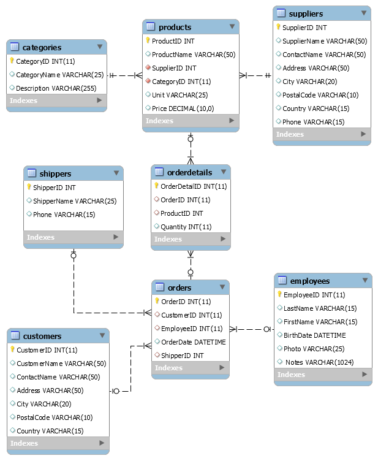
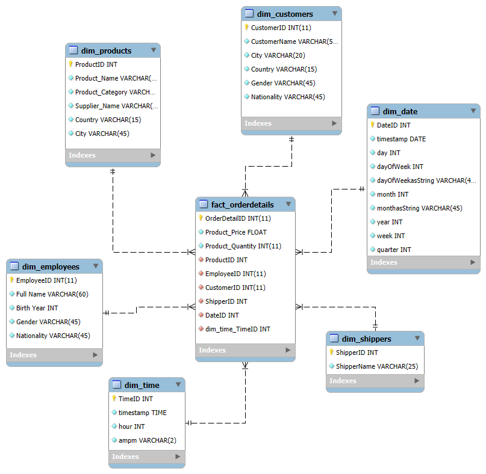

# ETL proces datasetu NorthWind

Tento repozitár obsahuje implementáciu ETL procesu v Snowflake pre analýzu dát z <b>NorthWind</b> datasetu. Projekt sa zameriava na preskúmanie správania používateľov a ich preferencií pri výbere produktov na základe hodnotení produktov a demografických údajov zákazníkov. Výsledný dátový model umožňuje multidimenzionálnu analýzu a vizualizáciu kľúčových metrik.

<h2>1. Úvod a popis zdrojových dát</h2>

Cieľom semestrálneho projektu je analyzovať dáta týkajúce sa produktov, zákazníkov a ich hodnotení. Táto analýza umožňuje identifikovať trendy v preferenciách zákazníkov, najpopulárnejšie produkty a správanie zákazníkov.

Zdrojové dáta pochádzajú z Kaggle datasetu dostupného <a href="https://www.kaggle.com/datasets/cleveranjosqlik/csv-northwind-database">tu</a>. Dataset obsahuje sedem hlavných tabuliek:

<ul>
  <li><code>categories</code></li>
  <li><code>products</code></li>
  <li><code>suppliers</code></li>
  <li><code>shippers</code></li>
  <li><code>orders</code></li>
  <li><code>customers</code></li>
  <li><code>employees</code></li>
</ul>

Účelom ETL procesu bolo tieto dáta pripraviť, transformovať a sprístupniť pre viacdimenzionálnu analýzu.

<h3>1.1 Dátová architektúra</h3>
<h3>ERD diagram</h3>

Surové dáta sú usporiadané v relačnom modeli, ktorý je znázornený na <b>entitno-relačnom diagrame (ERD):</b>

  
   
  <em>Obrázok 1 Entitno-relačná schéma AmazonBooks</em>

---
## **2 Dimenzionálny model**

Navrhnutý bol **hviezdicový model (star schema)**, pre efektívnu analýzu kde centrálny bod predstavuje faktová tabuľka **`fact_orderdetails`**, ktorá je prepojená s nasledujúcimi dimenziami:
- **`dim_products`**: Obsahuje podrobné informácie o produktoch (name, category, supplier_name,country,city).
- **`dim_shippers`**: Obsahuje údaje o zasielateľoch(shipper name).
- **`dim_employees`**: Obsahuje údaje o zamestnancoch (name, birth year, gender, nationality).
- **`dim_customers`**: Obsahuje údaje o zákazníkoch (name, city, country, gender, nationality).
- **`dim_date`**: Zahrňuje informácie o dátumoch objednavok (deň, mesiac, rok, štvrťrok).
- **`dim_time`**: Obsahuje podrobné časové údaje (hodina, AM/PM).

Štruktúra hviezdicového modelu je znázornená na diagrame nižšie. Diagram ukazuje prepojenia medzi faktovou tabuľkou a dimenziami, čo zjednodušuje pochopenie a implementáciu modelu.

  
   
  <em>Obrázok 2 Schéma hviezdy pre AmazonBooks</em>

