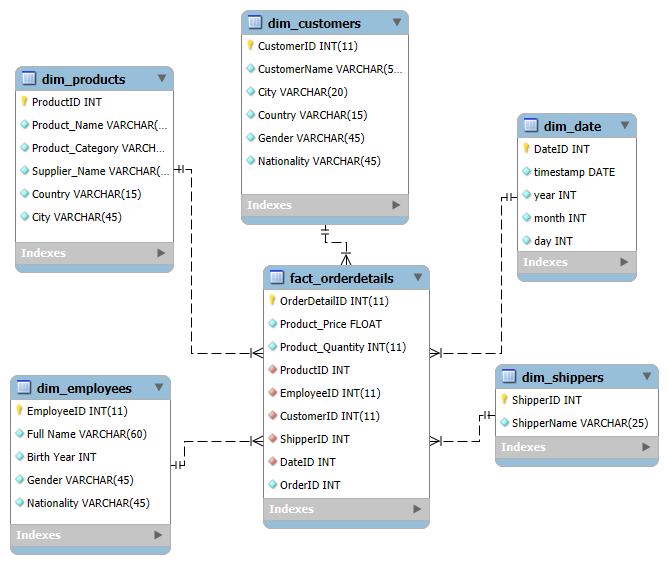

# ETL proces datasetu NorthWind
<p>
Tento repozitár obsahuje implementáciu ETL procesu v Snowflake pre analýzu dát z <b>NorthWind</b> datasetu. Projekt sa zameriava na preskúmanie správania používateľov a ich preferencií pri výbere produktov na základe hodnotení produktov a demografických údajov zákazníkov. Výsledný dátový model umožňuje multidimenzionálnu analýzu a vizualizáciu kľúčových metrik.
</p>
<hr>
<h2>1. Úvod a popis zdrojových dát</h2>
<p>
Cieľom semestrálneho projektu je analyzovať dáta týkajúce sa produktov, zákazníkov a ich hodnotení. Táto analýza umožňuje identifikovať trendy v preferenciách zákazníkov, najpopulárnejšie produkty a správanie zákazníkov.
</p>
<p>Zdrojové dáta pochádzajú z Kaggle datasetu dostupného <a href="https://www.kaggle.com/datasets/cleveranjosqlik/csv-northwind-database">tu</a>. Dataset obsahuje sedem hlavných tabuliek:</p>
<ul>
  <li><code>categories</code></li>
  <li><code>products</code></li>
  <li><code>suppliers</code></li>
  <li><code>shippers</code></li>
  <li><code>orders</code></li>
  <li><code>customers</code></li>
  <li><code>employees</code></li>
</ul>
<p>Účelom ETL procesu bolo tieto dáta pripraviť, transformovať a sprístupniť pre viacdimenzionálnu analýzu.</p>
<h3>1.1 Dátová architektúra</h3>
<h3>ERD diagram</h3>
<p>Surové dáta sú usporiadané v relačnom modeli, ktorý je znázornený na <b>entitno-relačnom diagrame (ERD):</b></p>
<p align="center">
  
  <br>
  <em>Obrázok 1 Entitno-relačná schéma AmazonBooks</em>
</p>

---
## **2 Dimenzionálny model**

Navrhnutý bol **hviezdicový model (star schema)**, pre efektívnu analýzu kde centrálny bod predstavuje faktová tabuľka **`fact_orderdetails`**, ktorá je prepojená s nasledujúcimi dimenziami:
- **`dim_products`**: Obsahuje podrobné informácie o produktoch (name, category, supplier_name,country,city).
- **`dim_shippers`**: Obsahuje údaje o zasielateľoch(shipper name).
- **`dim_employees`**: Obsahuje údaje o zamestnancoch (first name, last name, birth year).
- **`dim_customers`**: Obsahuje údaje o zákazníkoch (name, city, country).
- **`dim_date`**: Zahrňuje informácie o dátumoch objednavok (deň, mesiac, rok, štvrťrok).

Štruktúra hviezdicového modelu je znázornená na diagrame, ktorý ilustruje prepojenia medzi faktovou tabuľkou a jednotlivými dimenziami. Tento prístup uľahčuje pochopenie a implementáciu modelu.

<p align="center">
  
  <br>
  <em>Obrázok 2 Schéma hviezdy pre NorthWind</em>
</p>

---
## **3. ETL proces v Snowflake**
ETL proces zahŕňal tri kľúčové fázy: `extrakciu` (Extract), `transformáciu` (Transform) a `načítanie` (Load). Tento postup bol realizovaný v Snowflake s cieľom spracovať zdrojové dáta zo staging vrstvy a pripraviť ich do viacdimenzionálneho modelu, optimalizovaného na analýzu a vizualizáciu.

---
### **3.1 Extract (Extrahovanie dát)**
Dáta z `.csv` súboru boli nahrané do Snowflake pomocou interného stage úložiska `my_stage`, ktoré slúži na dočasný import alebo export dát. Stage bol vytvorený príkazom:

```sql
CREATE OR REPLACE STAGE my_stage;
```

Do stage boli nahrané súbory obsahujúce údaje o produktoch, zákazníkoch, objednávkach, zamestnancoch a dodávateľoch. Tieto dáta boli importované do staging tabuliek pomocou príkazu `COPY INTO`. Pre každú tabuľku bol použitý podobný príkaz:

```sql
COPY INTO categories_staging
FROM @my_stage/categories.csv
FILE_FORMAT = (TYPE = 'CSV' FIELD_OPTIONALLY_ENCLOSED_BY = '"' SKIP_HEADER = 1);
```

Po úspešnom importe dát je potrebné overiť správnosť pridania údajov do tabuľky. Na tento účel môžeme vykonať jednoduchý SQL dotaz, ktorý zobrazí prvých niekoľko riadkov z tabuľky:

```sql
SELECT * FROM categories_staging
```
Tento dotaz nám umožní skontrolovať, či boli údaje správne naimportované a či zodpovedajú očakávanému formátu.

---
### **3.2 Transform (Transformácia dát)**

Dáta zo staging tabuliek boli vyčistené, transformované a obohatené s cieľom pripraviť dimenzie a faktovú tabuľku pre efektívnu analýzu.

Dimenzia `dim_products` je navrhnutá na uchovávanie informácií o produktoch, vrátane ich názvov, kategórií, dodávateľov a geografických údajov. Transformácia zahŕňa spájanie údajov o produktoch s informáciami o kategóriách a dodávateľoch. Táto dimenzia je typu SCD Type 1, čo znamená, že keď dôjde k zmene informácií o produkte (napr. zmene kategórie alebo dodávateľa), staré údaje sú jednoducho aktualizované novými. Neuchováva sa história zmien.

Táto dimenzia poskytuje kontext pre analýzu objednávok a hodnotení produktov na základe rôznych atribútov, ako je kategória produktu, názov dodávateľa a jeho geografická poloha.
```sql
CREATE TABLE dim_products AS
SELECT DISTINCT
    p.ProductID,
    p.ProductName,
    c.CategoryName AS ProductCategory,
    s.SupplierName,
    s.Country,
    s.City
FROM products_staging p
JOIN categories_staging c ON p.CategoryID = c.CategoryID
JOIN suppliers_staging s ON p.SupplierID = s.SupplierID;
```

Dimenzia `dim_shippers` je navrhnutá na uchovávanie informácií o dodávateľoch. Poskytuje kontext pre analýzu údajov súvisiacich s metódami dopravy a dodávkami tovarov. Transformácia zahŕňa spájanie informácií o dodávateľoch, ako sú ich identifikátory a názvy. Táto dimenzia je typu SCD Type 1, čo znamená, že ak dôjde k zmene informácií o dodávateľovi (napríklad zmena názvu alebo informácií o doprave), staré údaje sú jednoducho nahradené novými. História zmien sa neuchováva.
```sql
CREATE TABLE dim_shippers AS
SELECT DISTINCT
    s.ShipperID,
    s.ShipperName
FROM shippers_staging s;
```
Dimenzia `dim_customers` je navrhnutá na uchovávanie informácií o zákazníkoch. Transformácia zahŕňa pridanie údajov o zákazníkoch, ako sú ich mená, mestá a krajiny. Tieto údaje poskytujú kontext pre analýzu zákazníckych dát. Zákazníci sú identifikovaní prostredníctvom CustomerID. V tejto dimenzii nebolo vykonané žiadne ďalšie spracovanie alebo rozdelenie hodnôt, napríklad vekové kategórie. Táto dimenzia je typu SCD Type 1, čo znamená, že ak dôjde k zmene informácií o zákazníkovi (napríklad zmena mena alebo adresy), staré údaje budú nahradené novými. História zmien sa neuchováva.
```sql
CREATE TABLE dim_customers AS
SELECT DISTINCT
    c.CustomerID,
    c.CustomerName,
    c.City,
    c.Country
FROM customers_staging c;
```

Dimenzia `dim_employees` uchováva informácie o zamestnancoch. Transformácia zahŕňa pridanie údajov o zamestnancoch, ako sú ich meno, priezvisko a rok narodenia. `BirthYear` je odvodený z `BirthDate` (využitý výrazy YEAR(e.BirthDate) na extrakciu roka). V tejto dimenzii je vykonaná transformácia týkajúca sa dátumu narodenia zamestnanca. Rok narodenia sa extrahuje zo stĺpca BirthDate, aby sa mohol použiť pri analýzach na základe veku. Táto dimenzia je typu SCD Type 1, čo znamená, že ak dôjde k zmene informácií o zamestnancovi (napríklad zmena mena), staré údaje budú nahradené novými. História zmien sa neuchováva.
```sql
CREATE TABLE dim_employees AS
SELECT DISTINCT
    e.EmployeeID,
    e.FirstName as First_Name,
    e.LastName as Last_Name,
    YEAR(e.BirthDate) as Birth_Year
FROM employees_staging e;
```

Dimenzia `dim_date` je navrhnutá na uchovávanie informácií o dátumoch objednávok. Transformácia zahŕňa extrakciu dátumu z poľa OrderDate a rozdelenie dátumu do rôznych častí, ako sú deň, mesiac a rok. Tieto údaje poskytujú kontext pre časové analýzy a umožňujú sledovanie trendov na základe dátumu. Dátumová dimenzia sa používa na priradenie k ostatným tabuľkám (napr. objednávky, hodnotenia) na analýzu v čase.

Táto dimenzia je typu SCD Type 0, čo znamená, že údaje o dátume sa považujú za statické a nezmeniteľné, a preto neexistuje potreba uchovávať históriu zmien. Ak je potrebné pridať nový dátum, bude jednoducho pridaný nový záznam do dimenzie, ale žiadne existujúce záznamy sa nemenia.
```sql
CREATE TABLE dim_date AS
SELECT DISTINCT
    ROW_NUMBER() OVER (ORDER BY CAST(OrderDate AS DATE)) AS DateID,
    CAST(OrderDate AS DATE) AS date,
    DATE_PART(year, OrderDate) AS year,
    DATE_PART(month, OrderDate) AS month,
    DATE_PART(day, OrderDate) AS day
FROM orders_staging
GROUP BY CAST(OrderDate AS DATE), 
         DATE_PART(day, OrderDate),
         DATE_PART(month, OrderDate), 
         DATE_PART(year, OrderDate);
```

Faktová tabuľka `fact_orderdetails` obsahuje detailné údaje o objednávkach, ktoré zahŕňajú informácie ako cena produktu, množstvo a prepojenia s dimenziami ako produkty, zamestnanci, zákazníci, dopravcovia a dátumy. Táto tabuľka spája údaje z rôznych dimenzií, ako je `dim_products`, `dim_employees`, `dim_customers`, `dim_shippers` a `dim_date`, aby poskytla komplexný pohľad na objednávky.

V tejto tabuľke je každému detailu objednávky priradený unikátny `OrderDetailID`, cena produktu je prevzatá z `products_staging`, pričom `ProductID` je prepojený s dimenziou `dim_products`. Množstvo produktov v objednávke je zobrazené ako `ProductQuantity`. `EmployeeID` a `CustomerID` sú priradené k zamestnancovi a zákazníkovi prostredníctvom dimenzií `dim_employees` a `dim_customers`, zatiaľ čo `ShipperID` je spojený s dopravcom z `dim_shippers`. Na záver, každý záznam je prepojený s konkrétnym dátumom cez `DateID` v dimenzii `dim_date`.
```sql
CREATE TABLE fact_orderdetails AS
SELECT 
    od.OrderDetailID,
    ps.Price AS ProductPrice,
    od.Quantity AS ProductQuantity,
    p.ProductID, 
    e.EmployeeID, 
    c.CustomerID, 
    s.ShipperID, 
    d.DateID,
    od.OrderID
FROM orderdetails_staging od 
JOIN orders_staging o ON od.OrderID = o.OrderID
JOIN products_staging ps ON od.ProductID = ps.ProductID
JOIN dim_products p ON od.ProductID = p.ProductID
JOIN dim_employees e ON o.EmployeeID = e.EmployeeID
JOIN dim_customers c ON o.CustomerID = c.CustomerID
JOIN dim_shippers s ON o.ShipperID = s.ShipperID
JOIN dim_date d ON CAST(o.OrderDate as DATE) = d.date;
```

---
### **3.3 Load (Načítanie dát)**

Po úspešnom vytvorení dimenzií a faktovej tabuľky boli dáta nahraté do finálnej štruktúry. Na záver boli staging tabuľky odstránené, aby sa optimalizovalo využitie úložiska:
```sql
DROP TABLE IF EXISTS books_staging;
DROP TABLE IF EXISTS education_levels_staging;
DROP TABLE IF EXISTS occupations_staging;
DROP TABLE IF EXISTS ratings_staging;
DROP TABLE IF EXISTS users_staging;
```
ETL proces v Snowflake umožnil spracovanie pôvodných dát z formátu `.csv` do viacdimenzionálneho modelu typu hviezda. Tento proces zahŕňal čistenie, obohacovanie a reorganizáciu údajov z rôznych tabuliek ako Orders, Customers, Employees, Products, a Shippers. Výsledný model umožňuje detailnú analýzu obchodných transakcií, predaja produktov, preferencií zákazníkov a správania zamestnancov, pričom poskytuje základ pre vizualizácie a reporty, ktoré sa dajú využiť pre optimalizáciu obchodných procesov, zlepšenie zákazníckej skúsenosti a analýzu výkonnosti.

---
## **4 Vizualizácia dát**

Graf 1: Top 10 najpredávanejších produktov
Tento graf ukazuje 10 produktov, ktoré majú najvyšší počet objednávok. Umožňuje identifikovať, ktoré produkty sú najobľúbenejšie medzi zákazníkmi. Takéto informácie môžu byť užitočné pri plánovaní skladových zásob a marketingových stratégiách.

```sql
SELECT 
    p.ProductName,
    COUNT(od.OrderDetailID) AS total_orders
FROM fact_orderdetails od
JOIN dim_products p ON od.ProductID = p.ProductID
GROUP BY p.ProductName
ORDER BY total_orders DESC
LIMIT 10;
ProductName z dim_products je názov produktu.
COUNT(od.OrderDetailID) počíta počet objednávok pre každý produkt.
GROUP BY p.ProductName zabezpečuje, že výsledky budú zoskupené podľa názvu produktu.
ORDER BY total_orders DESC zoradí produkty podľa počtu objednávok, od najvyššieho po najnižší.
```

Graf 2: Počet objednávok podľa zasielateľov
Tento graf ukazuje počet objednávok, ktoré boli doručené jednotlivými zasielateľmi. Pomáha to identifikovať, ktorí zasielatelia sú najvyťaženejší a môžu byť užitoční pri analýze dodávateľských reťazcov.
```sql
SELECT 
    s.ShipperName,
    COUNT(od.OrderDetailID) AS total_orders
FROM fact_orderdetails od
JOIN dim_shippers s ON od.ShipperID = s.ShipperID
GROUP BY s.ShipperName
ORDER BY total_orders DESC;
ShipperName z dim_shippers predstavuje meno zasielateľa.
COUNT(od.OrderDetailID) počíta počet objednávok pre každého zasielateľa.
GROUP BY s.ShipperName zabezpečuje zoskupenie podľa mena zasielateľa.
ORDER BY total_orders DESC zoradí zasielateľov podľa počtu objednávok.
```

Graf 3: Počet objednávok podľa rokov
Tento graf ukazuje, ako sa počet objednávok mení v priebehu rokov. Získané údaje môžu byť použité na analýzu trendov a sezónnosti v obchodoch a objednávkach.
```sql
SELECT 
    d.year AS year,
    COUNT(od.OrderDetailID) AS total_orders
FROM fact_orderdetails od
JOIN dim_date d ON od.DateID = d.DateID
GROUP BY d.year
ORDER BY d.year;
year z dim_date predstavuje rok, v ktorom bola objednávka uskutočnená.
COUNT(od.OrderDetailID) počíta počet objednávok v každom roku.
GROUP BY d.year zoskupuje výsledky podľa roku.
ORDER BY d.year zoradí výsledky podľa rokov vzostupne.
```

Graf 4: Počet objednávok podľa dní
Tento graf ukazuje, ako sa počet objednávok mení počas rôznych dní v mesiaci. Pomôže identifikovať najaktívnejšie dni, ktoré môžu ovplyvniť rozhodovanie o marketingových kampaniach alebo skladových zásobách.
```sql
SELECT 
    d.day AS day,
    COUNT(od.OrderDetailID) AS total_orders
FROM fact_orderdetails od
JOIN dim_date d ON od.DateID = d.DateID
GROUP BY d.day
ORDER BY total_orders DESC;
day z dim_date označuje deň v mesiaci.
COUNT(od.OrderDetailID) počíta počet objednávok v konkrétny deň.
GROUP BY d.day zoskupuje výsledky podľa dňa.
ORDER BY total_orders DESC zoradí dni podľa počtu objednávok.
```

Graf 5: Počet objednávok podľa miest zákazníkov
Tento graf zobrazuje, ktoré mestá majú najväčší počet objednávok. Tieto informácie môžu byť využité na analýzu geografických preferencií zákazníkov a plánovanie marketingových aktivít v jednotlivých regiónoch.
```sql
SELECT 
    c.City AS customer_city,
    COUNT(od.OrderDetailID) AS total_orders
FROM fact_orderdetails od
JOIN dim_customers c ON od.CustomerID = c.CustomerID
GROUP BY c.City
ORDER BY total_orders DESC;
City z dim_customers predstavuje mesto zákazníka.
COUNT(od.OrderDetailID) počíta počet objednávok z každého mesta.
GROUP BY c.City zabezpečuje zoskupenie výsledkov podľa mesta.
ORDER BY total_orders DESC zoradí mestá podľa počtu objednávok.
```
