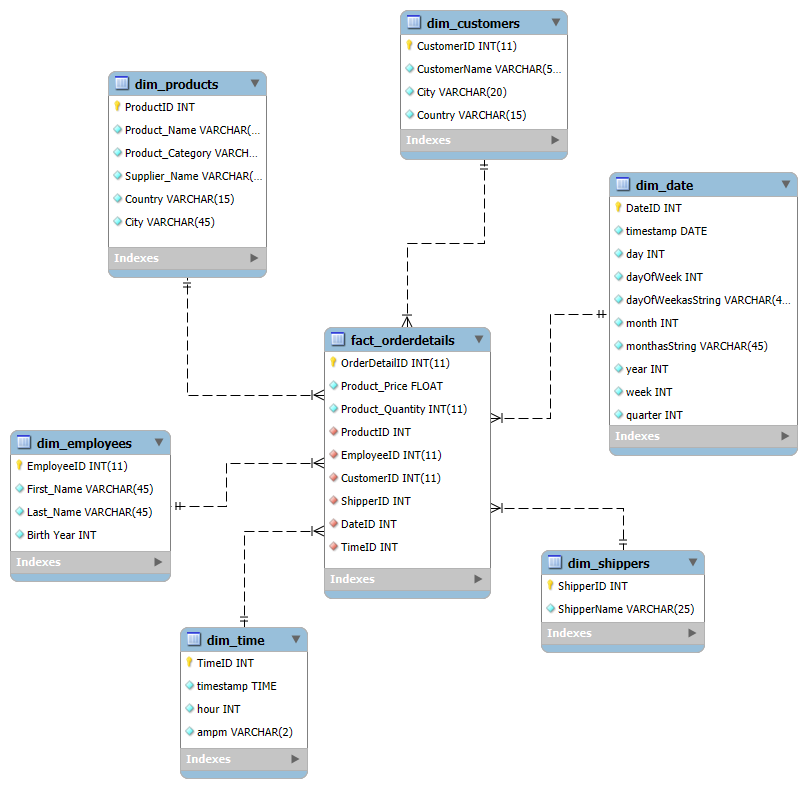

# ETL proces datasetu NorthWind
<p>
Tento repozitár obsahuje implementáciu ETL procesu v Snowflake pre analýzu dát z <b>NorthWind</b> datasetu. Projekt sa zameriava na preskúmanie správania používateľov a ich preferencií pri výbere produktov na základe hodnotení produktov a demografických údajov zákazníkov. Výsledný dátový model umožňuje multidimenzionálnu analýzu a vizualizáciu kľúčových metrik.
</p>
<hr>
<h2>1. Úvod a popis zdrojových dát</h2>
<p>
Cieľom semestrálneho projektu je analyzovať dáta týkajúce sa produktov, zákazníkov a ich hodnotení. Táto analýza umožňuje identifikovať trendy v preferenciách zákazníkov, najpopulárnejšie produkty a správanie zákazníkov.
</p>
<p>Zdrojové dáta pochádzajú z Kaggle datasetu dostupného <a href="https://www.kaggle.com/datasets/cleveranjosqlik/csv-northwind-database">tu</a>. Dataset obsahuje sedem hlavných tabuliek:</p>
<ul>
  <li><code>categories</code></li>
  <li><code>products</code></li>
  <li><code>suppliers</code></li>
  <li><code>shippers</code></li>
  <li><code>orders</code></li>
  <li><code>customers</code></li>
  <li><code>employees</code></li>
</ul>
<p>Účelom ETL procesu bolo tieto dáta pripraviť, transformovať a sprístupniť pre viacdimenzionálnu analýzu.</p>
<h3>1.1 Dátová architektúra</h3>
<h3>ERD diagram</h3>
<p>Surové dáta sú usporiadané v relačnom modeli, ktorý je znázornený na <b>entitno-relačnom diagrame (ERD):</b></p>
<p align="center">
  
  <br>
  <em>Obrázok 1 Entitno-relačná schéma AmazonBooks</em>
</p>

---
## **2 Dimenzionálny model**

Navrhnutý bol **hviezdicový model (star schema)**, pre efektívnu analýzu kde centrálny bod predstavuje faktová tabuľka **`fact_orderdetails`**, ktorá je prepojená s nasledujúcimi dimenziami:
- **`dim_products`**: Obsahuje podrobné informácie o produktoch (name, category, supplier_name,country,city).
- **`dim_shippers`**: Obsahuje údaje o zasielateľoch(shipper name).
- **`dim_employees`**: Obsahuje údaje o zamestnancoch (first name, last name, birth year).
- **`dim_customers`**: Obsahuje údaje o zákazníkoch (name, city, country).
- **`dim_date`**: Zahrňuje informácie o dátumoch objednavok (deň, mesiac, rok, štvrťrok).

Štruktúra hviezdicového modelu je znázornená na diagrame, ktorý ilustruje prepojenia medzi faktovou tabuľkou a jednotlivými dimenziami. Tento prístup uľahčuje pochopenie a implementáciu modelu.

<p align="center">
  
  <br>
  <em>Obrázok 2 Schéma hviezdy pre NorthWind</em>
</p>

---
## **3. ETL proces v Snowflake**
ETL proces zahŕňal tri kľúčové fázy: `extrakciu` (Extract), `transformáciu` (Transform) a `načítanie` (Load). Tento postup bol realizovaný v Snowflake s cieľom spracovať zdrojové dáta zo staging vrstvy a pripraviť ich do viacdimenzionálneho modelu, optimalizovaného na analýzu a vizualizáciu.

---
### **3.1 Extract (Extrahovanie dát)**
Dáta z `.csv` súboru boli nahrané do Snowflake pomocou interného stage úložiska `my_stage`, ktoré slúži na dočasný import alebo export dát. Stage bol vytvorený príkazom:

```sql
CREATE OR REPLACE STAGE my_stage;
```

Do stage boli nahrané súbory obsahujúce údaje o produktoch, zákazníkoch, objednávkach, zamestnancoch a dodávateľoch. Tieto dáta boli importované do staging tabuliek pomocou príkazu `COPY INTO`. Pre každú tabuľku bol použitý podobný príkaz:

```sql
COPY INTO categories_staging
FROM @my_stage/categories.csv
FILE_FORMAT = (TYPE = 'CSV' FIELD_OPTIONALLY_ENCLOSED_BY = '"' SKIP_HEADER = 1);
```

Po úspešnom importe dát je potrebné overiť správnosť pridania údajov do tabuľky. Na tento účel môžeme vykonať jednoduchý SQL dotaz, ktorý zobrazí prvých niekoľko riadkov z tabuľky:

```sql
SELECT * FROM categories_staging
```
Tento dotaz nám umožní skontrolovať, či boli údaje správne naimportované a či zodpovedajú očakávanému formátu.

---
### **3.2 Transform (Transformácia dát)**

Dáta zo staging tabuliek boli vyčistené, transformované a obohatené na prípravu dimenzií a faktovej tabuľky pre analýzu.

Dimenzie boli navrhnuté na poskytovanie kontextu pre faktovú tabuľku. 
`Dim_employees` obsahuje údaje o zamestnancoch vrátane ich jedinečného identifikátora, mena, priezviska a roku narodenia. Transformácia zahŕňala premenovanie stĺpcov na zrozumiteľnejšie názvy (napr. `FirstName` na `First_Name`, `LastName` na `Last_Name`) a extrahovanie roku narodenia zo stĺpca dátumu narodenia. Táto dimenzia by mohla byť prispôsobená ako SCD 2, ak by bolo potrebné sledovať historické zmeny v údajoch zamestnancov, ako sú napríklad zmeny mena alebo iné osobné údaje v priebehu času. V súčasnej implementácii však uchováva len statické údaje.
```sql
CREATE TABLE dim_employees AS
SELECT DISTINCT
    e.EmployeeID,
    e.FirstName as First_Name,
    e.LastName as Last_Name,
    YEAR(e.BirthDate) as Birth_Year,
FROM employees_staging e;
```
`Dim_date` obsahuje údaje o dátumoch vrátane jedinečného identifikátora dátumu (DateID), konkrétneho dátumu, dňa, dňa v týždni, názvu dňa v týždni, mesiaca, názvu mesiaca, roku, týždňa a kvartálu.

Transformácia zahŕňala:
- Priradenie jedinečného identifikátora dátumu (DateID) pomocou funkcie `ROW_NUMBER`.
- Extrahovanie jednotlivých zložiek dátumu (deň, mesiac, rok, týždeň, kvartál) pomocou funkcie `DATE_PART`.
- Pridanie číselnej reprezentácie dňa v týždni (1 = Pondelok, 7 = Nedeľa).
- Transformáciu číselných hodnôt dňa v týždni a mesiaca na ich textové reprezentácie v slovenčine (napr. 1 = „Pondelok“, 1 = „Január“).

Táto dimenzia je vhodná na analytické účely, ako napríklad skupinové agregácie, sezónne analýzy alebo vytváranie časových hierarchií (deň, mesiac, kvartál, rok). Dátumová dimenzia sa vytvára z údajov v tabuľke `orders_staging` a umožňuje efektívne prepojenie faktov s konkrétnymi časovými obdobiam.
```sql
CREATE TABLE DIM_DATE AS
SELECT
    ROW_NUMBER() OVER (ORDER BY CAST(OrderDate AS DATE)) AS DateID, 
    CAST(OrderDate AS DATE) AS date,                    
    DATE_PART(day, OrderDate) AS day,                   
    DATE_PART(dow, OrderDate) + 1 AS dayOfWeek,        
    CASE DATE_PART(dow, OrderDate) + 1
        WHEN 1 THEN 'Pondelok'
        WHEN 2 THEN 'Utorok'
        WHEN 3 THEN 'Streda'
        WHEN 4 THEN 'Štvrtok'
        WHEN 5 THEN 'Piatok'
        WHEN 6 THEN 'Sobota'
        WHEN 7 THEN 'Nedeľa'
    END AS dayOfWeekAsString,
    DATE_PART(month, OrderDate) AS month,              
    CASE DATE_PART(month, OrderDate)
        WHEN 1 THEN 'Január'
        WHEN 2 THEN 'Február'
        WHEN 3 THEN 'Marec'
        WHEN 4 THEN 'Apríl'
        WHEN 5 THEN 'Máj'
        WHEN 6 THEN 'Jún'
        WHEN 7 THEN 'Júl'
        WHEN 8 THEN 'August'
        WHEN 9 THEN 'September'
        WHEN 10 THEN 'Október'
        WHEN 11 THEN 'November'
        WHEN 12 THEN 'December'
    END AS monthAsString,
    DATE_PART(year, OrderDate) AS year,                
    DATE_PART(week, OrderDate) AS week,               
    DATE_PART(quarter, OrderDate) AS quarter           
FROM orders_staging
GROUP BY CAST(OrderDate AS DATE), 
         DATE_PART(day, OrderDate), 
         DATE_PART(dow, OrderDate), 
         DATE_PART(month, OrderDate), 
         DATE_PART(year, OrderDate), 
         DATE_PART(week, OrderDate), 
         DATE_PART(quarter, OrderDate);
```
`Fact_orderdetails` obsahuje údaje o detailoch objednávok, ktoré zahŕňajú transakčné dáta o produktoch, objednaných množstvách a ich cenách, ako aj odkazy na rôzne dimenzie ako produkt, zamestnanec, zákazník, dopravca, dátum a čas.

Transformácia zahŕňala:
- Priradenie jedinečného identifikátora detailu objednávky (`OrderDetailID`), ktorý jednoznačne identifikuje každú položku objednávky.
- Spojenie dát z rôznych dimenzií (produkty, zamestnanci, zákazníci, dopravcovia, dátumy a časy) prostredníctvom vonkajších kľúčov, čím sa umožňuje efektívne prepojenie faktov (detailov objednávky) s príslušnými dimenziami.
- Cena produktu a množstvo sú uložené ako metriky transakcie, ktoré umožňujú analýzu objednávok na rôznych úrovniach.
Táto faktová tabuľka je vhodná pre analytické účely, ako sú analýza predaja, sledovanie objednávok podľa produktov a zákazníkov, a meranie výkonu zamestnancov alebo dopravcov. Vytvára sa zo zdrojových dát v tabuľke `orderdetails_staging` a umožňuje flexibilné a detailné analýzy, ktoré zahŕňajú údaje o predaji a objednávkach v rámci rôznych dimenzií (produkt, zamestnanec, zákazník, dopravca, dátum, čas).
```sql
CREATE TABLE fact_orderdetails AS
SELECT DISTINCT
    od.OrderDetailID,
    ps.Price AS ProductPrice,
    od.Quantity AS ProductQuantity,
    p.ProductID, 
    e.EmployeeID, 
    c.CustomerID, 
    s.ShipperID, 
    d.DateID, 
    t.TimeID
FROM orderdetails_staging od JOIN orders_staging o ON od.OrderID = o.OrderID
JOIN products_staging ps ON od.ProductID = ps.ProductID
JOIN dim_products p ON od.ProductID = p.ProductID
JOIN dim_employees e ON o.EmployeeID = e.EmployeeID
JOIN dim_customers c ON o.CustomerID = c.CustomerID
JOIN dim_shippers s ON o.ShipperID = s.ShipperID
JOIN dim_date d ON CAST(o.OrderDate as DATE) = d.date
JOIN dim_time t ON o.OrderDate = t.timestamp;
```

---
### **3.3 Load (Načítanie dát)**

Po úspešnom vytvorení dimenzií a faktovej tabuľky boli dáta nahraté do finálnej štruktúry. Na záver boli staging tabuľky odstránené, aby sa optimalizovalo využitie úložiska:
```sql
DROP TABLE IF EXISTS books_staging;
DROP TABLE IF EXISTS education_levels_staging;
DROP TABLE IF EXISTS occupations_staging;
DROP TABLE IF EXISTS ratings_staging;
DROP TABLE IF EXISTS users_staging;
```
ETL proces v Snowflake umožnil spracovanie pôvodných dát z formátu `.csv` do viacdimenzionálneho modelu typu hviezda. Tento proces zahŕňal čistenie, obohacovanie a reorganizáciu údajov z rôznych tabuliek ako Orders, Customers, Employees, Products, a Shippers. Výsledný model umožňuje detailnú analýzu obchodných transakcií, predaja produktov, preferencií zákazníkov a správania zamestnancov, pričom poskytuje základ pre vizualizácie a reporty, ktoré sa dajú využiť pre optimalizáciu obchodných procesov, zlepšenie zákazníckej skúsenosti a analýzu výkonnosti.

---
## **4 Vizualizácia dát**

